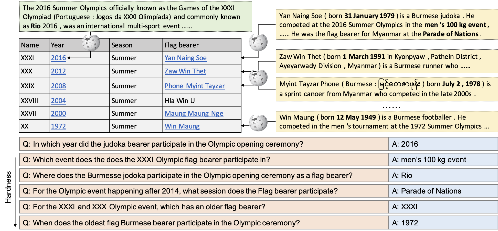

# HybridQA
This repository contains the dataset and code for the EMNLP2020 paper [HybridQA: A Dataset of Multi-Hop Question Answeringover Tabular and Textual Data](https://arxiv.org/pdf/2004.07347.pdf), which is the first large-scale multi-hop question answering dataset on heterogeneous data including tabular and textual data. The whole dataset contains over 70K question-answer pairs based on 13,000 tables, each table is in average linked to 44 passages, more details in https://hybridqa.github.io/.
<p align="center">

</p>
The questions are annotated to require aggregation of information from both the table and its hyperlinked text passages, which poses challenges to existing homongeneous text-based or KB-based models. 

# Requirements:
- [huggingface transformer 2.6.0](https://github.com/huggingface/transformers)
- [pytorch 1.4.0](https://pytorch.org/)
- tensorboardX
- tqdm

# Dataset Visualization
Have fun interacting with the dataset: https://hybridqa.github.io/explore.html

# Released data:
The released data contains the following files:
```
train/dev/test.json: these files are the original files, all annotated by human.
train/dev.traced.json: these files are generated by trace_answer.py to find the answer span in the given evidences.
```

# Preprocess data:
First of all, you should download all the tables and passages into your current folder
```
git clone https://github.com/wenhuchen/WikiTables-WithLinks
```
Then, you can either preprocess the data on your own,
```
python preprocessing.py
```
or use our preprocessed version from Amazon S3
```
wget https://hybridqa.s3-us-west-2.amazonaws.com/preprocessed_data.zip
unzip preprocessed_data.zip
```

# Reproduce the reported results
## Download the trained bert-base model from Amazon S3:
```
wget https://hybridqa.s3-us-west-2.amazonaws.com/models.zip
unzip BERT-base-uncased.zip
```
It will download and generate folder stage1/stage2/stage3/

## Using pretrained model to run stage1/stage2:
```
CUDA_VISIBLE_DEVICES=0 python train_stage12.py --stage1_model stage1/2020_10_03_22_47_34/checkpoint-epoch2 --stage2_model stage2/2020_10_03_22_50_31/checkpoint-epoch2/ --do_lower_case --predict_file preprocessed_data/dev_inputs.json --do_eval --option stage12 --model_name_or_path  bert-large-uncased
```
This command generates a intermediate result file
## Using pretrained model to run stage3:
```
CUDA_VISIBLE_DEVICES=0 python train_stage3.py --model_name_or_path stage3/2020_10_03_22_51_12/checkpoint-epoch3/ --do_stage3   --do_lower_case  --predict_file predictions.intermediate.json --per_gpu_train_batch_size 12  --max_seq_length 384   --doc_stride 128 --threads 8
```
This command generates the prediction file
## Compute the score
```
python evaluate_script.py predictions.json released_data/dev_reference.json
```


# Training [Default for Bert-base-uncased model]
## Train Stage1:
Running training command for stage1 using BERT-base-uncased as follows:
```
CUDA_VISIBLE_DEVICES=0 python train_stage12.py --do_lower_case --do_train --train_file preprocessed_data/stage1_training_data.json --learning_rate 2e-6 --option stage1 --num_train_epochs 3.0
```
Or Running training command for stage1 using BERT-large-uncased as follows:
```
CUDA_VISIBLE_DEVICES=0 python train_stage12.py --model_name_or_path bert-large-uncased --do_train --train_file preprocessed_data/stage1_training_data.json --learning_rate 2e-6 --option stage1 --num_train_epochs 3.0
```

## Train Stage2:
Running training command for stage2 as follows:
```
CUDA_VISIBLE_DEVICES=0 python train_stage12.py --do_lower_case --do_train --train_file preprocessed_data/stage2_training_data.json --learning_rate 5e-6 --option stage2 --num_train_epochs 3.0
```
Or BERT-base-cased/BERT-large-uncased like above.


## Train Stage3:
Running training command for stage3 as follows:
```
CUDA_VISIBLE_DEVICES=0 python train_stage3.py --do_train  --do_lower_case   --train_file preprocessed_data/stage3_training_data.json  --per_gpu_train_batch_size 12   --learning_rate 3e-5   --num_train_epochs 4.0   --max_seq_length 384   --doc_stride 128  --threads 8
```
Or BERT-base-cased/BERT-large-uncased like above.

## Model Selection for Stage1/2:
Model Selction command for stage1 and stage2 as follows:
```
CUDA_VISIBLE_DEVICES=0 python train_stage12.py --do_lower_case --do_eval --option stage1 --output_dir stage1/[OWN_PATH]/ --predict_file preprocessed_data/stage1_dev_data.json
```

# Evaluation
## Model Evaluation Step1 -> Stage1/2:
Evaluating command for stage1 and stage2 as follows (replace the stage1_model and stage2_model path with your own):
```
CUDA_VISIBLE_DEVICES=0 python train_stage12.py --stage1_model stage1/[OWN_PATH] --stage2_model stage2/[OWN_PATH] --do_lower_case --predict_file preprocessed_data/dev_inputs.json --do_eval --option stage12
```
The output will be saved into predictions.intermediate.json, which contain all the answers for non hyper-linked cells, with the hyperlinked cells, we need the MRC model in stage3 to extract the span.

## Model Evaluation Step2 -> Stage3:
Evaluating command for stage3 as follows (replace the model_name_or_path with your own):
```
CUDA_VISIBLE_DEVICES=0 python train_stage3.py --model_name_or_path stage3/[OWN_PATH] --do_stage3   --do_lower_case  --predict_file predictions.intermediate.json --per_gpu_train_batch_size 12  --max_seq_length 384   --doc_stride 128 --threads 8
```
The output is finally saved to predictoins.json, which can be used to calculate F1/EM with reference file.

## Computing the score
```
python evaluate_script.py predictions.json released_data/dev_reference.json
```

# CodaLab Evaluation
We host CodaLab challenge in [HybridQA Competition](https://codalab.lisn.upsaclay.fr/competitions/7979), you should submit your results to the competition to obtain your testing score. The submitted file should first be named "test_answers.json" and then zipped. The required format of the submission file is described as follows:
```
[
  {
    "question_id": xxxxx,
    "pred": XXX
  },
  {
    "question_id": xxxxx,
    "pred": XXX
  }
]
```
The reported scores are EM and F1.

# Recent Papers


**Model**                                     |  **Organization**  |**Reference**                                                             | **Dev-EM** | **Dev-F1** | **Test-EM** | **Test-F1** | 
----------|---------------------------|-----------------------------------|---------------------------------------------------------------------------|---------|----------|------------------|
S<sup>3</sup>HQA | CASIA     |  [Lei et al. (2023)](https://arxiv.org/pdf/2305.11725.pdf)                 | 68.4  | 75.3 |  67.9  | 75.5 |
MAFiD            | JBNU & NAVER | [Lee et al. (2023)](https://aclanthology.org/2023.findings-eacl.177.pdf)| 66.2  | 74.1 |  65.4  | 73.6 |
TACR             | TIT & NTU | [Wu et al. (2023)](https://arxiv.org/pdf/2305.14682.pdf)                 |   64.5  | 71.6 |  66.2   | 70.2 |
UL-20B           | Google    | [Tay et al. (2022)](https://arxiv.org/abs/2205.05131)                    |   -     | -    |  61.0  | -    |
MITQA            | IBM & IIT | [Kumar et al. (2021)](https://arxiv.org/pdf/2112.07337.pdf)              |   65.5  | 72.7 |  64.3  | 71.9 |
RHGN             | SEU       | [Yang et al. (2022)](https://link.springer.com/epdf/10.1007/s11227-022-05035-9?sharing_token=kouLCEDp9_vH1RkK8N9CAPe4RwlQNchNByi7wbcMAY4kj78xdT5rsS4-XKuj5N_XmnTRe7ko6X0kKaXyingc6wfoEGdQgx5hH9hDtcI6ivFPDd1p7A3RUWChRVmVBrgsvavXcujpAkPf2d1K1X-eE8ctae3eLrfxStzEdLP9uOs=)   |   62.8 | 70.4 |   60.6    |  68.1   |
POINTR + MATE    | Google    | [Eisenschlos et al. (2021)](https://arxiv.org/pdf/2109.04312.pdf)         |   63.3  | 70.8 |  62.7  | 70.0 |
POINTR + TAPAS   | Google    | [Eisenschlos et al. (2021)](https://arxiv.org/pdf/2109.04312.pdf)         |   63.4  | 71.0 |  62.8  | 70.2 |
MuGER<sup>2</sup>| JD AI     | [Wang et al. (2022)](https://arxiv.org/abs/2210.10350)                    | 57.1    | 67.3 | 56.3   |  66.2 |
DocHopper        | CMU       | [Sun et al. (2021)](https://arxiv.org/abs/2106.00200)                     |   47.7  | 55.0 |  46.3  | 53.3 |
HYBRIDER         | UCSB      | [Chen et al. (2020)](https://arxiv.org/abs/2004.07347)                    |   43.5  | 50.6 |  42.2  | 49.9 |
HYBRIDER-Large   | UCSB      | [Chen et al. (2020)](https://arxiv.org/abs/2004.07347)                    |  44.0   | 50.7 |  43.8  | 50.6 |
Unsupervised-QG  | NUS\&UCSB |  [Pan et al. (2020)](https://arxiv.org/abs/2010.12623)                    |    25.7 | 30.5 |   -    |  -   |


# Referenece
If you find this project useful, please use the following format to cite the paper:
```
@article{chen2020hybridqa,
  title={HybridQA: A Dataset of Multi-Hop Question Answering over Tabular and Textual Data},
  author={Chen, Wenhu and Zha, Hanwen and Chen, Zhiyu and Xiong, Wenhan and Wang, Hong and Wang, William},
  journal={Findings of EMNLP 2020},
  year={2020}
}
```


# Miscellaneous
If you have any question about the dataset and code, feel free to raise a github issue or shoot me an email. Thanks!
